# UML Diagrams - Disaster Relief Management System

This document contains comprehensive UML diagrams for the Disaster Relief Management System, including Use Case, Class, Activity, Data Flow, and Sequence diagrams.

---

## 1. Use Case Diagram

The Use Case diagram illustrates the interactions between different actors and the system.

```mermaid
graph TB
    subgraph "Disaster Relief Management System"
        UC1[Register/Login]
        UC2[View Disasters]
        UC3[Make Donation]
        UC4[Register as Volunteer]
        UC5[Manage Disasters]
        UC6[Manage Relief Camps]
        UC7[Manage Resources]
        UC8[Assign Volunteers]
        UC9[Generate Reports]
        UC10[View Dashboard]
        UC11[Track Donations]
        UC12[Request Resources]
    end
    
    Admin["👤 Admin"]
    Staff["👤 Staff"]
    Volunteer["👤 Volunteer"]
    Donor["👤 Donor"]
    Public["👤 Public User"]
    
    Admin --> UC1
    Admin --> UC5
    Admin --> UC6
    Admin --> UC7
    Admin --> UC8
    Admin --> UC9
    Admin --> UC10
    Admin --> UC11
    
    Staff --> UC1
    Staff --> UC5
    Staff --> UC6
    Staff --> UC7
    Staff --> UC12
    Staff --> UC10
    
    Volunteer --> UC1
    Volunteer --> UC4
    Volunteer --> UC10
    
    Donor --> UC1
    Donor --> UC3
    Donor --> UC11
    
    Public --> UC2
    Public --> UC3
    Public --> UC4
```

### Actors:
- **Admin**: Full system access, manages all aspects
- **Staff**: Manages disasters, camps, and resources
- **Volunteer**: Registers and views assignments
- **Donor**: Makes donations and tracks contributions
- **Public User**: Views disasters and makes donations

---

## 2. Class Diagram

The Class diagram shows the object-oriented structure of the system.

---

## 3. Activity Diagram - Disaster Response Workflow

This diagram shows the complete workflow for responding to a disaster event.

---

## 4. Data Flow Diagram (DFD) - Level 0

This diagram shows how data flows through the system.

```mermaid
flowchart LR
    subgraph External["External Entities"]
        Admin["👤 Admin"]
        Staff["👤 Staff"]
        Volunteer["👤 Volunteer"]
        Donor["👤 Donor"]
    end
    
    subgraph System["Disaster Relief Management System"]
        Auth["Authentication Module"]
        DisasterMgmt["Disaster Management"]
        CampMgmt["Camp Management"]
        ResourceMgmt["Resource Management"]
        DonationMgmt["Donation Management"]
        VolunteerMgmt["Volunteer Management"]
        Reporting["Reporting & Analytics"]
    end
    
    subgraph DataStores["Data Stores"]
        UserDB[("Users Database")]
        DisasterDB[("Disasters Database")]
        CampDB[("Camps Database")]
        ResourceDB[("Resources Database")]
        DonationDB[("Donations Database")]
        VolunteerDB[("Volunteers Database")]
    end
    
    Admin -->|Login Credentials| Auth
    Staff -->|Login Credentials| Auth
    Volunteer -->|Registration Data| Auth
    Donor -->|Registration Data| Auth
    
    Auth -->|User Data| UserDB
    UserDB -->|User Info| Auth
    
    Admin -->|Disaster Info| DisasterMgmt
    DisasterMgmt -->|Disaster Data| DisasterDB
    DisasterDB -->|Disaster Records| Reporting
    
    Staff -->|Camp Details| CampMgmt
    CampMgmt -->|Camp Data| CampDB
    
    Staff -->|Resource Info| ResourceMgmt
    ResourceMgmt -->|Resource Data| ResourceDB
    ResourceDB -->|Inventory Status| Reporting
    
    Donor -->|Donation Info| DonationMgmt
    DonationMgmt -->|Donation Data| DonationDB
    DonationDB -->|Donation Records| Reporting
    
    Volunteer -->|Availability| VolunteerMgmt
    VolunteerMgmt -->|Volunteer Data| VolunteerDB
    VolunteerDB -->|Assignment Info| Reporting
    
    Reporting -->|Reports| Admin
    Reporting -->|Statistics| Staff
```

---

## 5. Sequence Diagram - Donation Process

This diagram shows the sequence of interactions for making a donation.

---

## 6. Sequence Diagram - Volunteer Assignment

This diagram shows how volunteers are assigned to relief camps.

---

## 7. Entity-Relationship Diagram (ERD)

---

## Diagram Descriptions

### Use Case Diagram
Shows all possible interactions between system actors (Admin, Staff, Volunteer, Donor, Public) and the system functionalities.

### Class Diagram
Illustrates the object-oriented structure with all model classes, their attributes, methods, and relationships following the MVC pattern.

### Activity Diagram
Depicts the complete workflow from disaster occurrence through relief operations to resolution, including decision points and parallel processes.

### Data Flow Diagram
Shows how data moves between external entities, system processes, and data stores, illustrating the information flow architecture.

### Sequence Diagrams
Detail the step-by-step interactions between components for specific use cases (donation process and volunteer assignment).

### Entity-Relationship Diagram
Displays the database schema with all entities, their attributes, and relationships, showing cardinality and foreign key constraints.

---

## Design Patterns Used

1. **MVC (Model-View-Controller)**: Separates business logic, data, and presentation
2. **Singleton**: Database connection class ensures single instance
3. **Repository Pattern**: Models act as repositories for data access
4. **Front Controller**: AuthController handles all authentication requests

---

## Notes

- All diagrams are created using Mermaid syntax for easy rendering in markdown viewers
- Diagrams follow UML 2.0 standards
- Color coding in diagrams represents different actor roles and process types
- These diagrams should be included in project presentations and documentation
